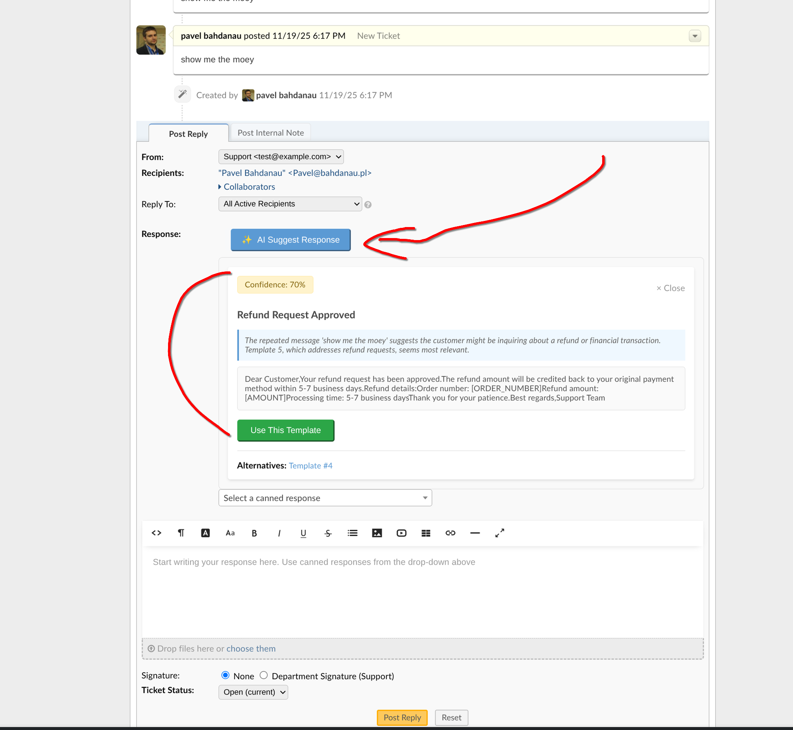

# AI Assistant Plugin for osTicket

## Overview
The AI Assistant plugin integrates OpenAI's GPT models into osTicket to assist support agents. It analyzes incoming ticket content and suggests the most appropriate "Canned Response" from the system's database, significantly reducing response time.

*Screenshot showing the AI Assistant suggesting a response template with 70% confidence for a customer ticket.*

## Features
- **Automated Analysis**: Analyzes ticket subject, body, and thread history using OpenAI.
- **Smart Matching**: Matches tickets with existing Canned Responses based on semantic meaning, not just keywords.
- **Context Aware**: Considers ticket priority and department.
- **Language-Aware**: Detects the ticket language and prefers canned responses written in the same language (for example, distinguishing Russian and Ukrainian).
- **One-Click Insertion**: Agents can preview the suggested response and insert it into the reply editor with a single click.
- **Configurable**: Adjustable confidence threshold, max templates limit, and model selection (GPT-5.x, GPT-4.x, o-series reasoning models, etc.).

## Installation

1. **Upload**: Copy the `ai-assistant` folder into your osTicket `include/plugins/` directory.
2. **Permissions**: Ensure the web server user (e.g., `www-data`) has read access to the files.
3. **Install**: 
   - Log in to osTicket Admin Panel.
   - Go to **Manage -> Plugins**.
   - Click **Add New Plugin**.
   - Click **Install** next to "AI Assistant".
4. **Enable**: Click on the installed plugin and change "Status" to **Active**.

## Configuration

Go to **Manage -> Plugins -> AI Assistant -> Config**.

- **API Provider**: Choose between OpenAI or Custom (for OpenAI-compatible APIs).
- **API Key**: Your secret key starting with `sk-...` (required).
- **API URL**: Custom endpoint URL (required for Custom provider, auto-filled for OpenAI).
- **Model**: Select the model from the dropdown or enter a custom model name.
- **Auto-suggest**: If enabled, analysis starts automatically when viewing a ticket.
- **Minimum Confidence Score**: Threshold (0-100) to filter weak suggestions.
- **Max Templates**: How many canned responses to send to AI for comparison (affects token usage).
- **Timeout**: Maximum time (in seconds) to wait for API response.
- **Enable Debug Logging**: Log API requests and responses for troubleshooting.

### Available Open AI Models

The plugin supports a wide range of OpenAI models. You can select from the dropdown or enter a custom model name for OpenAI-compatible APIs.

**GPT-5 Series (Latest)**
| Model | Description |
|-------|-------------|
| `gpt-5.2` | Latest model (Dec 2025), improved reasoning and speed |
| `gpt-5.1` | Optimized for coding and agentic tasks |
| `gpt-5.1-codex` | Specialized for code generation |
| `gpt-5.1-codex-mini` | Compact version for coding |
| `gpt-5.1-codex-max` | Project-scale coding tasks |
| `gpt-5-mini` | Fast and cost-efficient, 400K context window |
| `gpt-5-nano` | Fastest and cheapest in GPT-5 family |

**Reasoning Models (o-series)**
| Model | Description |
|-------|-------------|
| `o3` | Most advanced reasoning capabilities |
| `o3-mini` | Cost-efficient reasoning |
| `o4-mini` | Latest compact reasoning model |
| `o1` | Extended reasoning |
| `o1-mini` | Compact reasoning |

**GPT-4.1 Series**
| Model | Description |
|-------|-------------|
| `gpt-4.1` | Best for coding, supports 1M token context |
| `gpt-4.1-mini` | Balanced performance and cost |
| `gpt-4.1-nano` | Fastest in GPT-4.1 family |

**GPT-4o Series (Multimodal)**
| Model | Description |
|-------|-------------|
| `gpt-4o` | Multimodal, highly capable |
| `gpt-4o-mini` | Fast and affordable (recommended default) |

**Legacy Models**
| Model | Description |
|-------|-------------|
| `gpt-4-turbo` | Previous generation |
| `gpt-3.5-turbo` | Cheapest option |

> **Note**: If API Key, Model, or API URL is not configured, the plugin will return an error when attempting to analyze tickets.

## Architecture

### Files
- `plugin.php`: Entry point and metadata.
- `ai-assistant.php`: Main plugin class (`AiAssistantPlugin`). Handles hooks, asset injection, and AJAX routing.
- `config.php`: Configuration form definition (`AiAssistantConfig`). Contains model selection widget.
- `class.analyzer.php`: Core logic (`OsticketAIAssistantTicketAnalyzer`). Orchestrates data gathering and AI analysis.
- `class.api-client.php`: API client (`OsticketAIAssistantAPIClient`). Handles communication with OpenAI-compatible APIs.
- `js/ai-assistant.js`: Frontend logic. Injects button, handles clicks, displays modal.
- `css/ai-assistant.css`: Styles for the suggestion modal.

### Logic Flow
1. **Injection**: On ticket view (`tickets.php`), `AiAssistantPlugin` injects JS/CSS.
2. **Trigger**: User clicks "AI Suggest Response".
3. **Request**: JS sends AJAX POST to `/scp/ajax.php/ai-assistant/suggest` with `ticket_id`.
4. **Dispatch**: osTicket dispatcher routes request to `ai_assistant_handle_suggest` global function.
5. **Analysis**:
   - `OsticketAIAssistantTicketAnalyzer` fetches ticket data (subject, body).
   - It fetches active Canned Responses (global + department specific).
   - `OsticketAIAssistantAPIClient` sends this data to the AI API with a prompt to find the best match.
6. **Response**: JSON with the best template ID and reasoning is returned.
7. **UI**: JS shows a modal with the suggested response. User confirms to insert into editor.

## Troubleshooting

- **500 Error**: Check Apache error logs. Ensure file permissions are correct.
- **401 Error**: Incorrect API Key. Check whitespace or validity of the key.
- **No canned responses**: Ensure you have active Canned Responses in the Knowledgebase.

## Authors
- **Pavel Bahdanau**
- **Anatoly Melnikov**

## License
This project is licensed under the GNU General Public License v2.0 - see the [LICENSE](LICENSE) file for details.
